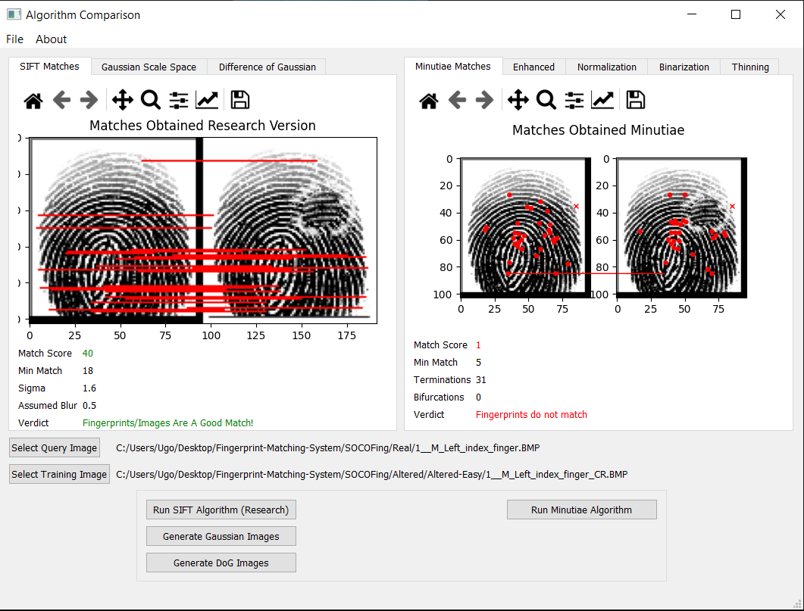
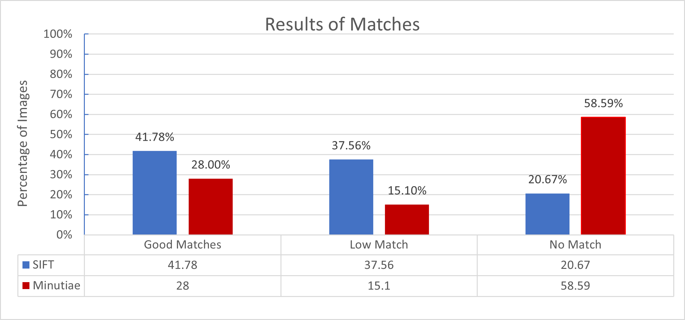
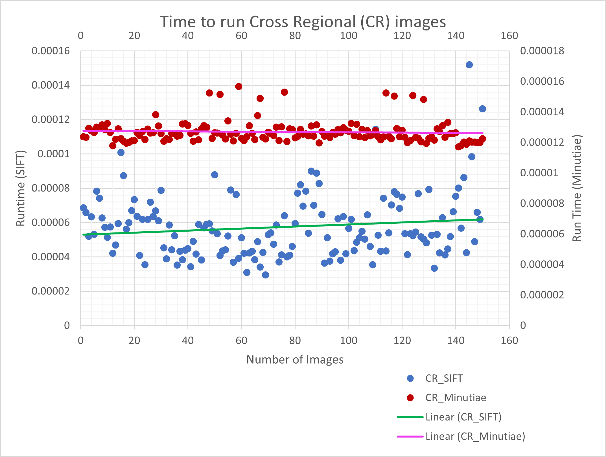
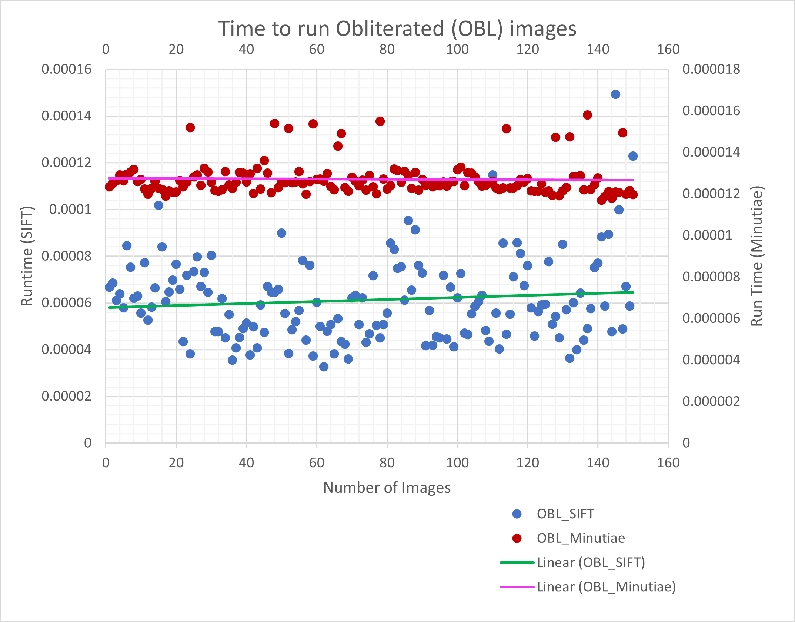
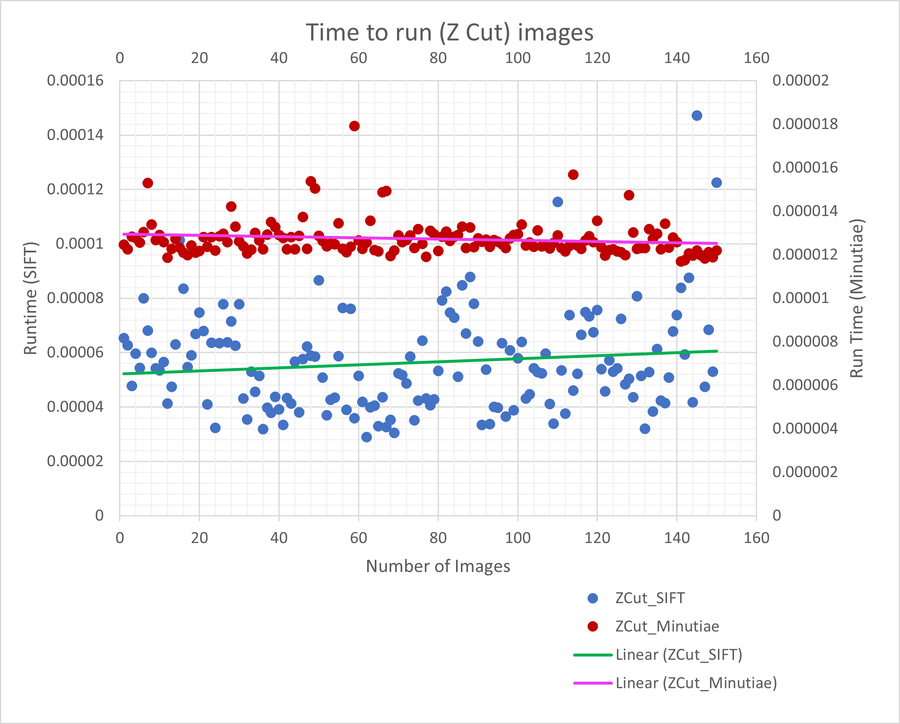

# Fingerprint-Matching-System
 Fingerprint Matching System using Scale Invariant Feature Transform and Minutiae Matching. This project was done as a final year project for the award of a BSc. in Computer Science at the University of Ghana, Legon.

## How to setup
```
- pip install all requirements   (Algorithms > requirements.txt)

- Run Ui_code.py     (ALGORITHMS > GUI > UI_CODE.py)
```

## Sample Data & Results
Sample results found in [Data](https://github.com/Mini-Sylar/Fingerprint-Matching-System/tree/main/Algorithms/Data)

## DATA GENERATION
Automated data generation script can be found in [AUTOMATE DATA COLLECTION](https://github.com/Mini-Sylar/Fingerprint-Matching-System/blob/main/Algorithms/GUI/CollectData.py)


## Deliverables
Writeup can be found in
[THESIS](https://github.com/Mini-Sylar/Fingerprint-Matching-System/tree/main/Deliverables)

<hr/>

## Credits
All references and citations can be found in [REFERENCES](https://github.com/Mini-Sylar/Fingerprint-Matching-System/blob/main/Deliverables/A%20Comparative%20Analysis%20of%20Fingerprint%20Matching%20Algorithms%20v.2.0.docx) 

## Screenshots





